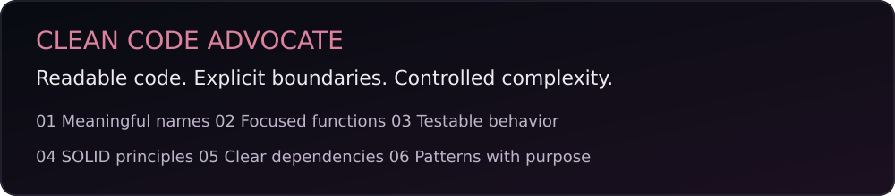
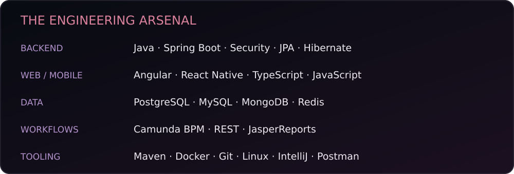
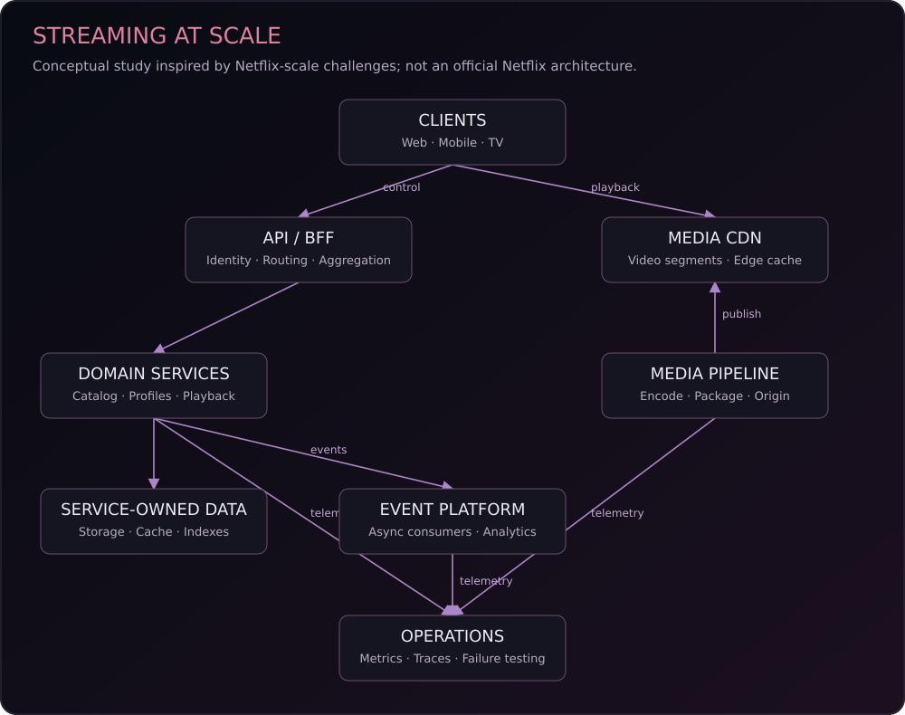
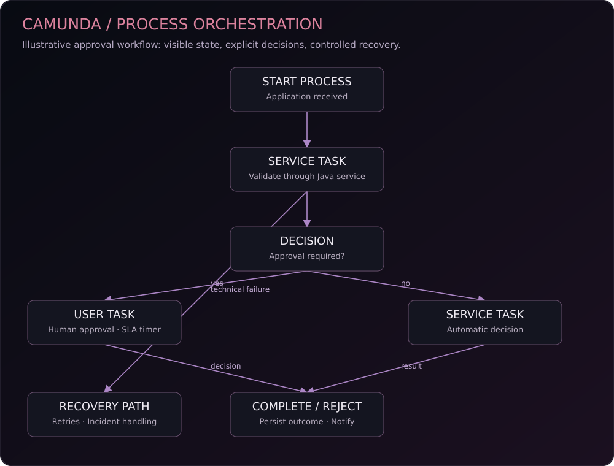

  

<b>Senior Full Stack Java Developer · Spring Ecosystem · Clean Code Advocate</b>

  <a href="https://github.com/unknown1fsh?tab=repositories">Repositories</a> ·
  <a href="https://github.com/unknown1fsh?tab=overview">GitHub activity</a> ·
  <a href="https://www.linkedin.com/in/ssercanc/">LinkedIn</a>

## Engineering identity

Building enterprise applications with Java and Spring, web interfaces with Angular, and cross-platform mobile experiences with React Native. Focused on maintainable code, clear service boundaries, database performance, and visible business workflows.

**Clean Code Advocate** is the guiding principle: code should explain its intent, make failures understandable, and remain affordable to change.

## Core stack

<b>Engineering practices</b>

- REST API design, validation and centralized exception handling.
- Spring Security, transaction boundaries and JPA persistence.
- DTO mapping with MapStruct and dynamic queries with Specifications.
- SQL optimization, index design and deliberate ORM usage.
- Component architecture and responsive web interfaces.
- Camunda workflow automation and JasperReports reporting.

## Distributed systems / streaming at scale

A conceptual architecture study inspired by Netflix-scale engineering challenges. It illustrates a separation between API traffic and media delivery; it is not Netflix's official architecture or a claim of employment.

**Design concerns:** bounded timeouts, selective retries with backoff, idempotency, fault isolation, graceful degradation, independent scaling and end-to-end observability.

## Camunda BPM / orchestration

Domain logic belongs in services. Process flow, waiting states and human approvals remain visible in the orchestrator.

| Concern | Responsibility |
| --- | --- |
| Business rules and persistence | Java domain services |
| Process sequence and waiting state | Camunda orchestration |
| Human approval and deadlines | User tasks and timer events |
| Transient technical failures | Configured job or worker retries; incidents after exhaustion |
| Business rejection | Explicit process outcome or modeled business error |
| Undoing completed business work | Explicit compensation handlers, where required |

## Transmission

> I see everything, Carl. And in the end, you'll be the one working for me.

  

## Engineering doctrine

| Boundary | Purpose |
| --- | --- |
| Controller | Transport, request validation and API contracts |
| Service | Business rules, use cases and transactions |
| Repository | Persistence and data access |

Small responsibilities. Meaningful names. Explicit dependencies. Patterns that earn their place. Tests that verify behavior.

## Activity & connection

[Contribution history](https://github.com/unknown1fsh) · [Explore repositories](https://github.com/unknown1fsh?tab=repositories) · [LinkedIn](https://www.linkedin.com/in/ssercanc/)

